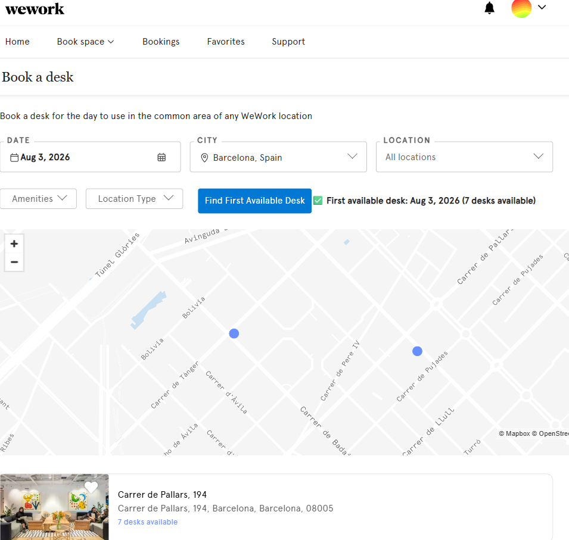

# WeWork Desk Finder Extension

A lightweight browser extension that helps you automatically find the first available desk on the WeWork booking page.
It injects a button into the **Book a desk** page and simulates the same actions a user would perform: opening the calendar, selecting dates, waiting for results, and checking availability.

---

## Features
- Adds a **Find First Available Desk** button to the WeWork booking page.
- Iterates through upcoming dates until it finds availability.
- Detects both available desks and the "Sorry, there are no desks available" message.
- Includes a **Stop** button to interrupt the search at any time.
- Works in both **Google Chrome** and **Microsoft Edge**.

---

## Installation (Manual)

### Step 1: Download
Clone or download this repository to your computer.

### Step 2: Open Extensions Page
- **Chrome:** go to `chrome://extensions`
- **Edge:** go to `edge://extensions`

### Step 3: Enable Developer Mode
Toggle **Developer mode** on (top right corner).

### Step 4: Load Unpacked
Click **Load unpacked** and select the folder containing:
- `manifest.json`
- `content.js`
- (optional) `icon.png`

### Step 5: Navigate to WeWork
Open [https://members.wework.com](https://members.wework.com), go to **Book a desk**, and you’ll see the new button injected automatically.

---

## Screenshots

### Result Found

---

## Notes
- This extension is not affiliated with WeWork. It’s a personal productivity tool.  
- Works best when run on the **Book a desk** page (`<h1 class="page-title">Book a desk</h1>`).  
- No background scripts or popup UI are required — everything runs in `content.js`.

---

## License
MIT License – feel free to use, modify, and share.
